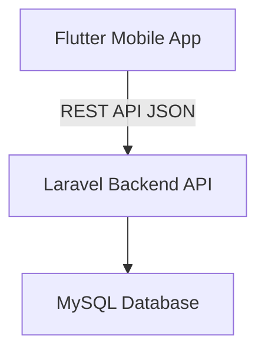

# SIGAPIT Mobile (Flutter)

SIGAPIT Mobile adalah aplikasi pengaduan masalah informasi dan teknologi (IT) berbasis **Flutter** yang terintegrasi
dengan backend **Laravel** (SIGAPIT Web).  
Aplikasi ini ditujukan untuk **role Pengadu**, sedangkan Admin dan Kepala Dinas
menggunakan versi web.

---

## 🚀 Fitur Utama
- Login 
- Dashboard pengadu
- List & detail pengaduan
- Buat pengaduan + upload gambar
- Attachment private 
- Preview fullscreen + zoom
- Light & Dark Mode 
- Bottom Navigation

---

## 🧱 Arsitektur Sistem


---

## 🔐 Integrasi dengan SIGAPIT Web

Aplikasi mobile **TIDAK berdiri sendiri**, tetapi menggunakan **backend yang sama**
dengan aplikasi web SIGAPIT.

### 🔹 Backend yang digunakan
- Laravel 10
- Laravel Sanctum (Authentication)
- Role-based access control

### 🔹 Pembagian Role
| Role | Platform |
|-----|----------|
| Pengadu | Mobile (Flutter) |
| Admin | Web |
| Kepala Dinas | Web |

---

## 🔄 Alur Integrasi Mobile ↔ Web

### 1️⃣ Autentikasi
- Mobile login via `POST /api/login`
- Token disimpan menggunakan Sanctum
- Token dikirim via header:
  Authorization: Bearer <token>

### 2️⃣ Pengaduan
- Mobile create pengaduan via:
  POST /api/tickets
- Admin & Kepala Dinas memproses pengaduan via Web
- Status update otomatis terlihat di Mobile
- 
### 3️⃣ Attachment (Private)
- Gambar disimpan di:
  storage/app/private/
- Akses via:
  GET /api/attachments/{id}
- Hanya user terautentikasi yang bisa mengakses

---

## 🗄️ Struktur Database (Ringkas)

- users
- tickets
- ticket_histories
- attachments
- roles

Relasi:
- user → tickets
- ticket → histories
- ticket → attachments

---

## 🛠️ Teknologi yang Digunakan

### Mobile
- Flutter
- Dio (HTTP Client)
- SharedPreferences
- Material 3

### Backend
- Laravel
- Sanctum
- MySQL

---

## 📦 Build APK

```bash
flutter build apk --release
```
Output:
```
build/app/outputs/flutter-apk/SIGAPIT.apk
```
